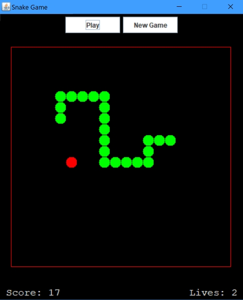

# Snake-Game-MVC

To test my JAVA GUI skills I recreated the classic Snake game using a MVC (model - view - controller) software design pattern. 
Implementing the snake game using the MVC pattern made my code a lot longer than other simpler implemntations. Additionally, all the GUI
componenets are hard-coded meaning I didn't use Design view.

## How it works
The player has to control the snake which appears on the screen using the arrow keys and has to navigatethe snake to eat the apple.
When the snake eats the apple it grows in length and continues to grow in length as it devours more apples.

To die the snake has to either hit the border or touch itself. Players are given 3 lives after which the game is over and the player has to restart. The player can also start a New Game anytime during the game.

## Game GUI

Note: The game works fully but it doesnt follow the true MVC design pattern so the project is still a work in progress. 

